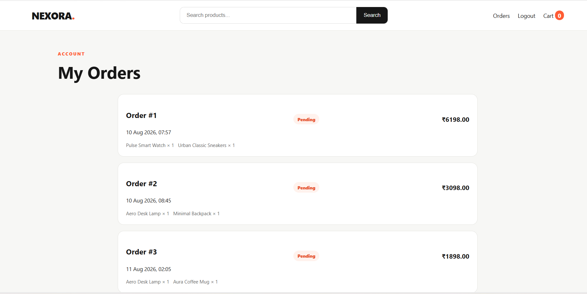

# 🛍️ NEXORA — Full-Stack E-Commerce Website

**NEXORA** is a modern full-stack e-commerce web application built with **Python, Django, HTML, and CSS**.

The project provides a complete shopping experience including product browsing, authentication, shopping cart management, checkout, order history, and Django administration.

---

## 🚀 Features

* 🏠 Modern home page
* 🛍️ Product listing
* 📄 Product details
* 🛒 Shopping cart
* 🔐 User login and registration
* 💳 Checkout system
* 📦 Order history
* ⚙️ Django Admin panel
* 🗄️ Database integration
* 📱 Responsive frontend
* 🔎 Product browsing
* 👤 User authentication

---

## 🛠️ Technologies Used

| Technology | Purpose                       |
| ---------- | ----------------------------- |
| 🐍 Python  | Backend programming           |
| 🎯 Django  | Web framework                 |
| 🌐 HTML5   | Page structure                |
| 🎨 CSS3    | Styling and responsive design |
| 🗄️ SQLite | Database                      |
| 🔧 Git     | Version control               |
| 🐙 GitHub  | Source code hosting           |

---

## 📂 Project Structure

```text
NEXORA_CodeAlpha_Ecommerce/
│
├── manage.py
├── requirements.txt
├── README.md
│
├── screenshots/
│   ├── home.png
│   ├── products.png
│   ├── cart.png
│   ├── checkout.png
│   ├── login.png
│   ├── order.png
│   └── admin.png
│
├── templates/
├── static/
├── media/
│
└── ...
```

---

# ⚙️ Installation & Setup

Follow these steps to run NEXORA locally.

### 1. Clone the repository

```bash
git clone https://github.com/kalaspsp76-code/CodeAlpha_NEXORA_Ecommerce.git
```

### 2. Open the project folder

```bash
cd CodeAlpha_NEXORA_Ecommerce
```

### 3. Create a virtual environment

```bash
python -m venv venv
```

### 4. Activate the virtual environment

**Windows:**

```bash
venv\Scripts\activate
```

### 5. Install dependencies

```bash
pip install -r requirements.txt
```

### 6. Apply database migrations

```bash
python manage.py migrate
```

### 7. Add sample products

```bash
python manage.py seed_products
```

### 8. Create an admin account

```bash
python manage.py createsuperuser
```

Enter your username, email, and password when prompted.

### 9. Start the development server

```bash
python manage.py runserver
```

Open the application:

**http://127.0.0.1:8000/**

Django Admin:

**http://127.0.0.1:8000/admin/**

---

# 📸 Screenshots

## 🏠 Home Page


---

## 🛍️ Product Listing


---

## 🛒 Shopping Cart


---

## 🔐 Login / Registration


---

## 💳 Checkout


---

## 📦 Order History



---

## ⚙️ Django Admin


---

# 🎓 CodeAlpha Internship

This project was developed as part of the **CodeAlpha Full Stack Development Internship**.

### Task 1 — Simple E-Commerce Store

The project demonstrates practical experience with:

* Full-stack web development
* Django application development
* Database management
* User authentication
* Shopping cart implementation
* Order processing
* Frontend development
* Git and GitHub

---

# 🔮 Future Improvements

Future versions of NEXORA could include:

* 💳 Online payment gateway
* 📧 Order confirmation emails
* 📦 Real-time order tracking
* ❤️ Persistent wishlist
* ⭐ Product reviews and ratings
* 🔎 Advanced product filtering
* 👤 Enhanced user profiles
* 📊 Sales analytics dashboard
* ☁️ Cloud deployment
* 🔐 Additional security improvements

---

# 📌 Repository

**Repository:** `CodeAlpha_NEXORA_Ecommerce`

**GitHub:**
https://github.com/kalaspsp76-code/CodeAlpha_NEXORA_Ecommerce

---

# 👨‍💻 Author

**Kala S P**

GitHub:
https://github.com/kalaspsp76-code

---

⭐ If you find this project interesting, consider giving the repository a star.

> **NEXORA — A modern full-stack e-commerce experience.**
