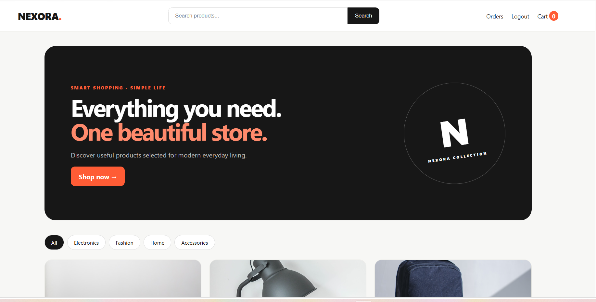
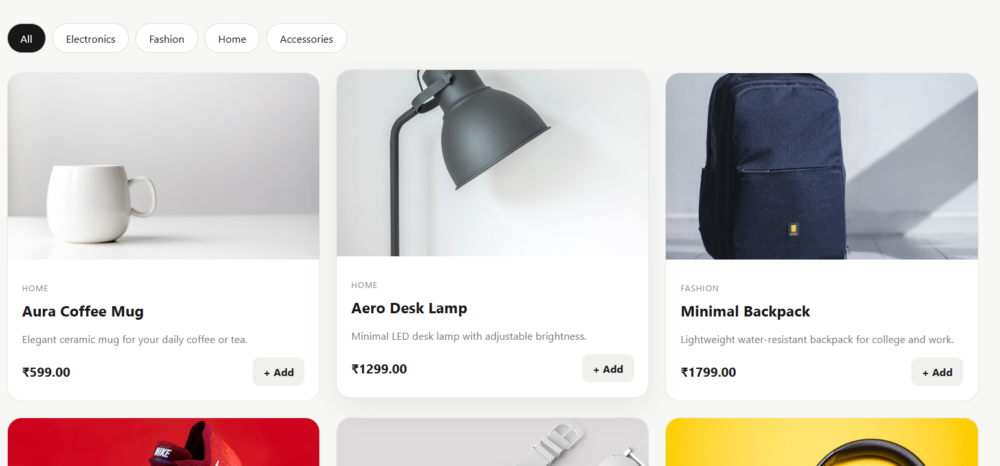
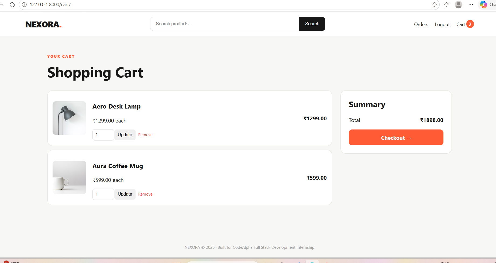
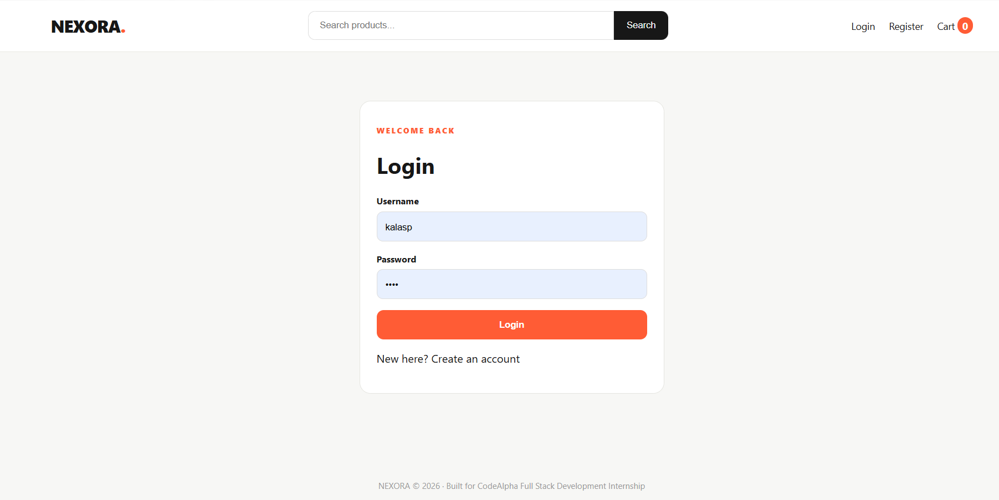
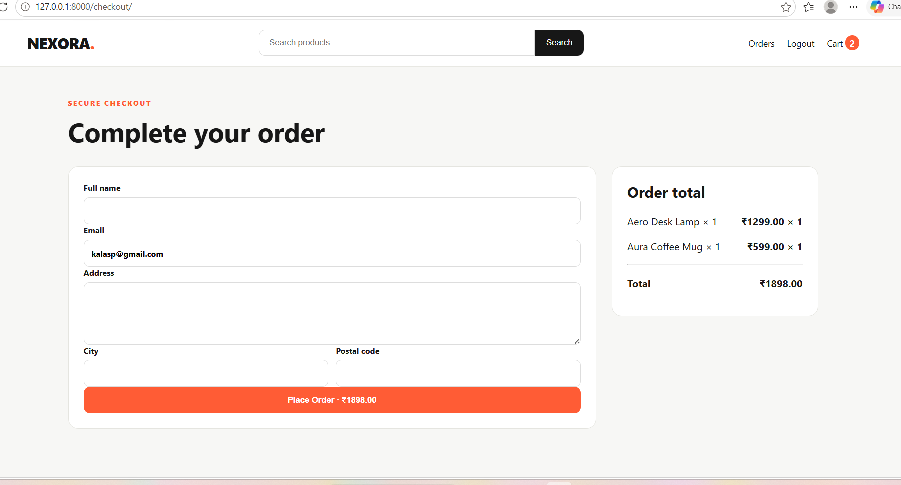
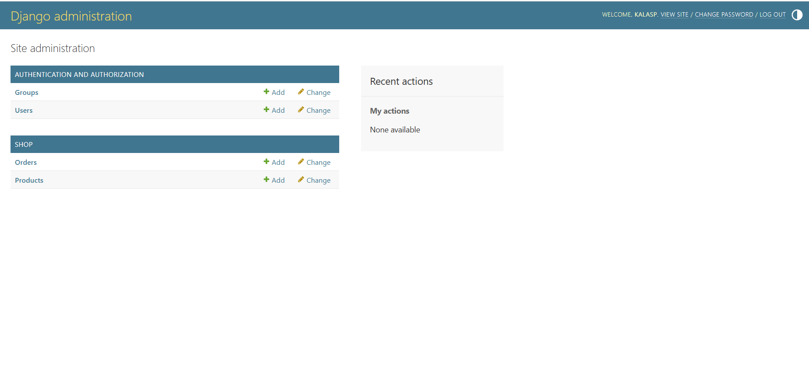

# 🛍️ NEXORA — CodeAlpha Task 1: Simple E-Commerce Store

**NEXORA** is a professional full-stack e-commerce website developed as **CodeAlpha Internship — Task 1**.

The application provides a complete online shopping experience with product browsing, search, category filtering, authentication, session-based shopping cart functionality, checkout, order processing, and order history.

## 🚀 Features

* 🛍️ Product listing
* 🔍 Product search
* 🏷️ Category filtering
* 📄 Product details page
* 🛒 Session-based shopping cart
* ➕ Quantity updates
* ❌ Remove items from cart
* 👤 User registration
* 🔐 User login/logout
* 💳 Checkout and order processing
* 📦 Order history
* ⚙️ Django admin panel
* 🗄️ SQLite database
* 📱 Responsive user interface

## 🛠️ Technologies Used

| Technology | Purpose                       |
| ---------- | ----------------------------- |
| HTML5      | Website structure             |
| CSS3       | Styling and responsive design |
| JavaScript | Client-side interactivity     |
| Python     | Backend programming           |
| Django     | Web framework                 |
| SQLite     | Database                      |
| Git        | Version control               |
| GitHub     | Source code hosting           |

## 📂 Project Structure

```text
CodeAlpha_NEXORA_Ecommerce/
│
├── manage.py
├── requirements.txt
├── db.sqlite3
│
├── project/
│   ├── settings.py
│   ├── urls.py
│   └── ...
│
├── store/
│   ├── models.py
│   ├── views.py
│   ├── urls.py
│   ├── admin.py
│   └── management/
│
├── templates/
│   └── ...
│
├── static/
│   ├── css/
│   ├── js/
│   └── images/
│
└── README.md
```

> The exact folder names may vary depending on your current Django project structure.

## 💻 Run the Project Locally

### 1. Clone the repository

```bash
git clone https://github.com/kalaspsp76-code/CodeAlpha_NEXORA_Ecommerce.git
```

### 2. Open the project folder

```bash
cd CodeAlpha_NEXORA_Ecommerce
```

### 3. Create a virtual environment

```bash
python -m venv venv
```

### 4. Activate the virtual environment

**Windows:**

```bash
venv\Scripts\activate
```

### 5. Install dependencies

```bash
pip install -r requirements.txt
```

### 6. Apply database migrations

```bash
python manage.py migrate
```

### 7. Add sample products

```bash
python manage.py seed_products
```

### 8. Create an admin account

```bash
python manage.py createsuperuser
```

### 9. Start the Django development server

```bash
python manage.py runserver
```

Open the website:

**http://127.0.0.1:8000/**

Django Admin:

**http://127.0.0.1:8000/admin/**

## 📸 Screenshots

### 🏠 Home Page



### 🛍️ Product Listing



### 📄 Product Details


### 🛒 Shopping Cart



### 🔐 Login / Registration



### 💳 Checkout



### 📦 Order History


### ⚙️ Django Admin



## 🎓 CodeAlpha Internship

This project was developed as part of the **CodeAlpha Full Stack Development Internship**.

### Task

**Task 1 — Simple E-Commerce Store**

The project demonstrates practical experience with:

* Full-stack web development
* Django application development
* Database management
* User authentication
* Shopping cart implementation
* Order processing
* Frontend development
* Git and GitHub

## 🔮 Future Improvements

Future versions of NEXORA could include:

* 💳 Online payment gateway
* 📧 Order confirmation emails
* 📦 Real-time order tracking
* ❤️ Persistent wishlist
* ⭐ Product reviews and ratings
* 🔎 Advanced product filtering
* 👤 Enhanced user profiles
* 📊 Sales analytics dashboard
* ☁️ Cloud deployment
* 🔐 Additional security improvements

## 📌 Repository

**Repository:** `CodeAlpha_NEXORA_Ecommerce`

**GitHub:**
https://github.com/kalaspsp76-code/CodeAlpha_NEXORA_Ecommerce

## 👨‍💻 Author

**Kala S P**

GitHub:
https://github.com/kalaspsp76-code

---

⭐ If you find this project interesting, consider giving the repository a star.

**NEXORA — A modern full-stack e-commerce experience.**
